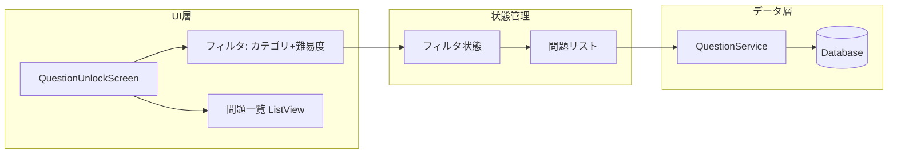

# 問題開放画面 ゼロベース再実装計画

## 方針

既存の `QuestionUnlockScreen` に依存せず、**レイアウト・ロジックともにゼロから設計**する。段階的に実装し、まずはルールクイズ＋難易度で100件表示されることを確実に確認する。

---

## 使いやすいUI/UX設計（ストレス軽減）

### 基本原則

| 原則 | 実装方針 |
|------|----------|
| **認知負荷の軽減** | 一度に表示する情報を絞る。フィルタはカテゴリに応じて必要なものだけ表示 |
| **明確な視覚階層** | セクションごとに余白を確保。見出し→フィルタ→一覧の流れを明確に |
| **操作の即時フィードバック** | フィルタ選択で即再取得。ローディング中はスピナー、完了で一覧表示 |
| **迷わない導線** | デフォルト選択（ルール＋easy）で初回から表示。チーム未選択時は「チームを選んでください」と明示 |
| **一貫性** | 既存の [AppColors](lib/constants/app_colors.dart)、[GlassMorphismWidget](lib/widgets/glass_morphism_widget.dart)、[ConfigurationScreen](lib/screens/configuration_screen.dart) のパターンを踏襲 |

### レイアウト構成

```
┌─────────────────────────────────────────┐
│ [←] 問題開放              ★ XXX PT      │  ← コンパクトなAppBar
├─────────────────────────────────────────┤
│ カテゴリ                                 │
│ [ルール] [歴史] [チーム]                  │  ← タップしやすいチップ（min 44pt）
│                                         │
│ 難易度  [EASY] [NORMAL] [HARD]           │
│                                         │
│ （チーム時のみ）国 [日本][伊][西][英]     │
│ （チーム時のみ）チーム ▼ 浦和レッズ       │  ← ドロップダウン or ボトムシート
├─────────────────────────────────────────┤
│ 問題一覧 (XX件)                          │  ← 件数表示で安心感
│ ┌─────────────────────────────────────┐ │
│ │ 問題文（2行まで）...                  │ │
│ │ [easy]  [XX PTで開放] or [見る]      │ │  ← 1カード1アクション
│ └─────────────────────────────────────┘ │
│ ...                                     │
└─────────────────────────────────────────┘
```

### 具体的なUX改善

1. **フィルタエリア**
   - カテゴリ・難易度は横スクロール可能なチップ（`Wrap` または `SingleChildScrollView`）
   - チップは最小タップ領域 44x44pt 以上
   - 選択中は `AppColors.techBlue` で明確にハイライト

2. **チーム選択（20件以上ある場合）**
   - 長いリストは `DropdownButton` または「チームを選択」タップで `showModalBottomSheet` を表示
   - ボトムシート内で検索可能にすると、応援チームを素早く見つけられる
   - [ConfigurationScreen](lib/screens/configuration_screen.dart) の `_buildTeamSelector` を参考に、国ごとのチーム一覧を表示

3. **問題カード**
   - 1カード1メインアクション（開放 or 見る）
   - 無料開放とPT消費は上下に分け、主アクションを目立たせる
   - カード間の余白 12pt 以上で視認性を確保

4. **ローディング・空状態**
   - ローディング: 中央に `CircularProgressIndicator` + 「読み込み中...」
   - 0件: 「この条件では問題がありません」と優しい文言
   - エラー: 「読み込みに失敗しました。もう一度お試しください」+ 再試行ボタン

5. **スクロール**
   - フィルタは上部固定（`SliverAppBar` の `pinned` や `Column` の上段）し、一覧だけスクロール
   - またはフィルタも含めて全体スクロール（シンプルな構成）

---

## Phase 1: 最小限のルールクイズ表示（MVP）

### 目標
- ルールクイズを選択 → 難易度を選択 → **100件の一覧が表示される**ことを確認
- ローディングで止まらない、シンプルで確実な実装

### 新規アーキテクチャ



### 設計原則

1. **build中に副作用なし**: `initState` または `FutureBuilder` / `AsyncNotifier` でデータ取得
2. **単一のデータフロー**: フィルタ変更 → 再取得 → 表示
3. **既存プロバイダーを活用**: `questionServiceProvider`, `unlockedQuestionIdsProvider` はそのまま利用

### 画面構成

上記「使いやすいUI/UX設計」のレイアウトに従う。タブ（未開放/開放済み）は一旦廃止し、一覧に未開放・開放済みを混在表示。カードのボタン（開放/見る）で区別する。

### チームクイズのチーム別フィルタ

チームクイズ選択時は、**国 → チーム** の2段階フィルタを表示する。ユーザーは応援チームを選び、そのチームの問題のみを表示できる。

| 国 | チーム例 |
|----|----------|
| 日本 | J1全チーム、J2全チーム、鹿島、浦和、柏、神戸、広島... |
| イタリア | セリエA全チーム、ユベントス、ACミラン、インテル |
| スペイン | ラリーガ全チーム、レアル、バルサ、アトレティコ |
| イングランド | プレミア全チーム、リバプール、アーセナル、マンC... |

- 国を変更するとチーム一覧が切り替わる
- チーム未選択時は「チームを選択してください」を表示
- `getQuestionsForUnlockScreen` に `country` と `team` を渡す（既存の [database_service.dart](lib/services/database_service.dart) の `team_id` 検索を利用）

### 実装方針

| 項目 | 方針 |
|------|------|
| データ取得 | `initState` + `addPostFrameCallback` で初回ロード。フィルタ変更時は `_loadQuestions()` を直接呼ぶ |
| 問題数 | ルールクイズは `limit: 100` で一括取得。チーム/歴史は50件ページネーション可 |
| チームフィルタ | チームクイズ時のみ国・チーム選択UIを表示。選択したチームの問題のみ取得 |
| 開放済み判定 | `unlockedQuestionIdsProvider` を watch。取得した問題リストと照合してフィルタ |
| エラー表示 | try-catch でエラー時は `Text('読み込みに失敗しました')` を表示 |

### 新規実装の流れ

1. **既存ファイルをバックアップ**（`question_unlock_screen.dart.bak` など）
2. **新規 `QuestionUnlockScreen` を一から記述**（上記UX原則に従う）
   - 状態: `_questions`, `_isLoading`, `_error`, `_selectedCategory`, `_selectedDifficulty`
   - `initState`: `addPostFrameCallback` で `_loadQuestions()` を1回だけ呼ぶ
   - フィルタ変更: `setState` でフィルタ更新 → `_loadQuestions()` を呼ぶ
   - 一覧: `_isLoading` なら `CircularProgressIndicator`、`_error` ならエラー表示、それ以外は `ListView.builder`
3. **ルールクイズ専用の簡易版**でまず動作確認
   - カテゴリ固定「ルール」、難易度選択のみ
   - `getQuestionsForUnlockScreen(category: 'rules', difficulty: selected, limit: 100, offset: 0)`
4. 動作確認後、**チームクイズのフィルタ**を追加
   - 国選択（日本/イタリア/スペイン/イングランド）
   - チーム選択（国に応じたチーム一覧。既存の `_getTeamListForCountry` 相当を流用）
   - チーム選択時のみ `country` と `team` を渡して取得
5. 歴史クイズの地域フィルタ（日本/世界）を追加

---

## Phase 2: レイアウト・UXの拡張

Phase 1 が安定したら:

- 未開放/開放済みタブの復活（必要なら）
- ページネーション（スクロールで追加読み込み）
- チーム選択のボトムシート化（20件超のチーム一覧を検索しやすく）
- カードデザインの微調整（余白・フォントサイズ）
- 無料開放・PT消費のボタン配置の最適化（主アクションを明確に）

---

## 変更対象

| ファイル | 対応 |
|----------|------|
| `lib/screens/question_unlock_screen.dart` | **全面書き換え**（既存をバックアップしてから） |
| `lib/services/question_service.dart` | 変更なし（`getQuestionsForUnlockScreen` をそのまま利用） |
| `lib/providers/question_unlock_provider.dart` | 変更なし |
| `lib/constants/app_constants.dart` | 必要なら `questionUnlockPageSize` を 100 に変更（ルール用） |

---

## 検証手順

**Phase 1（ルールクイズ）**
1. アプリ起動 → ホーム → 「問題開放」タップ
2. ルール＋easy がデフォルトで選択されている
3. **数秒以内に**問題一覧が表示される（ローディングで止まらない）
4. 100件表示されていることを確認
5. 難易度を normal / hard に変更 → それぞれ100件表示されることを確認

**チームクイズ**
6. カテゴリ「チーム」を選択 → 国・チームのフィルタが表示される
7. 国「日本」→ チーム「鹿島アントラーズ」を選択 → 鹿島関連の問題のみ表示される
8. チームを変更（例: 浦和レッズ）→ そのチームの問題のみに切り替わる
